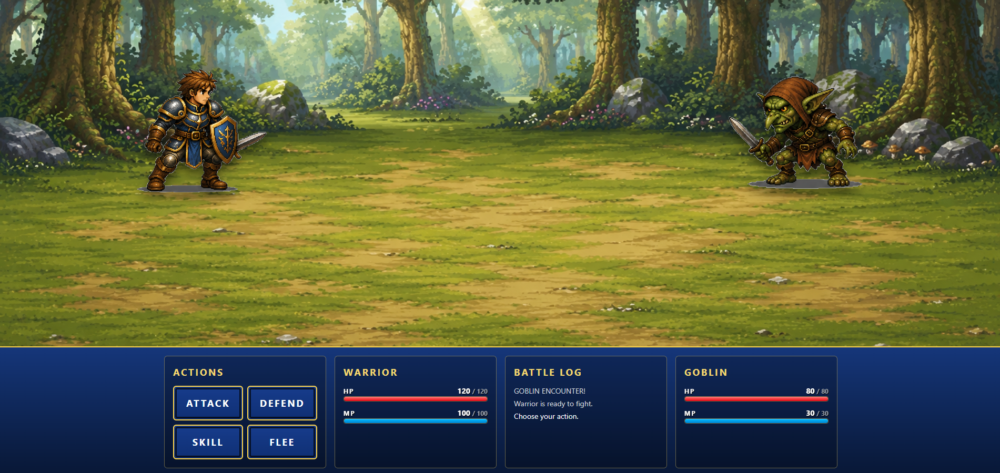
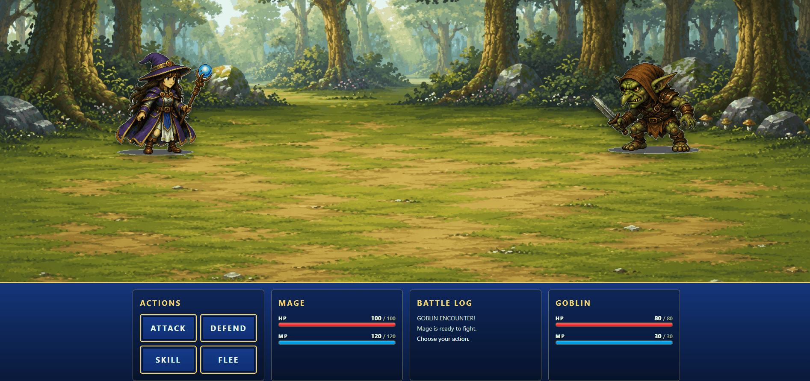
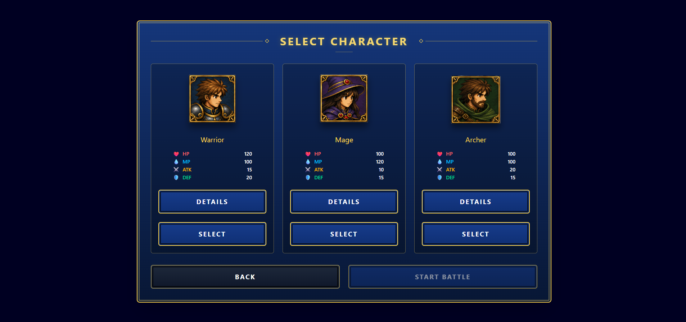
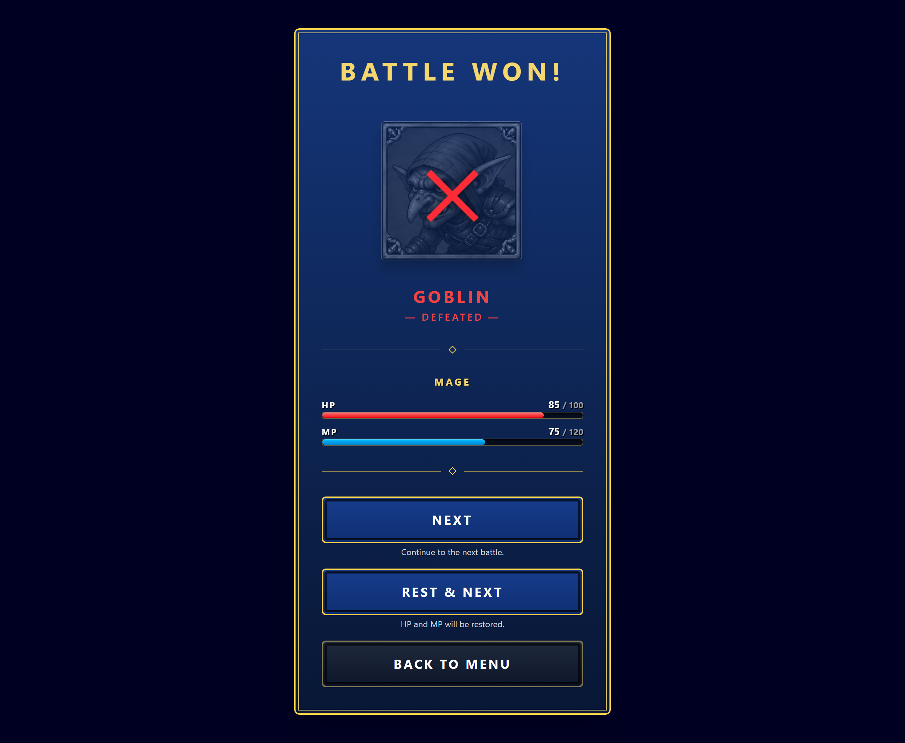
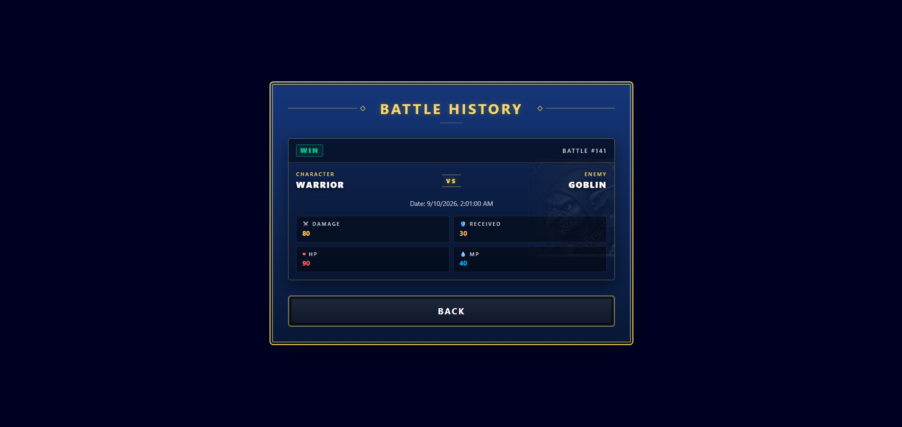
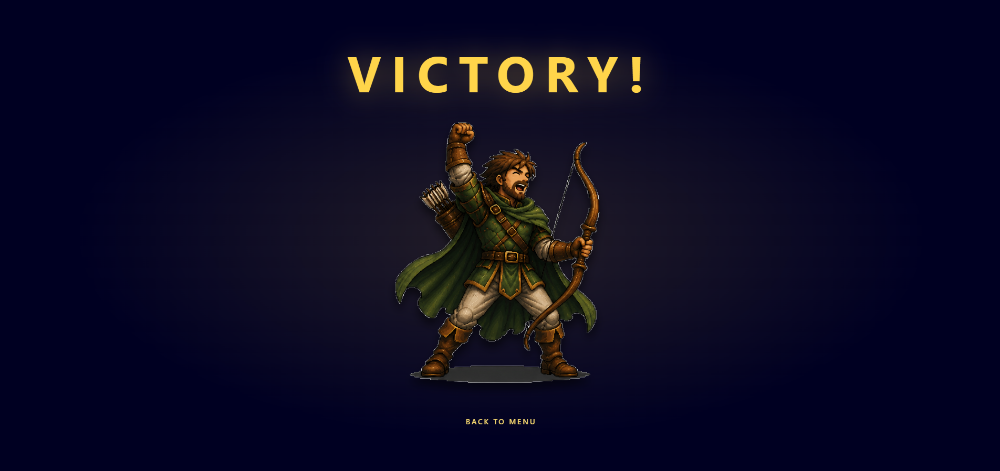
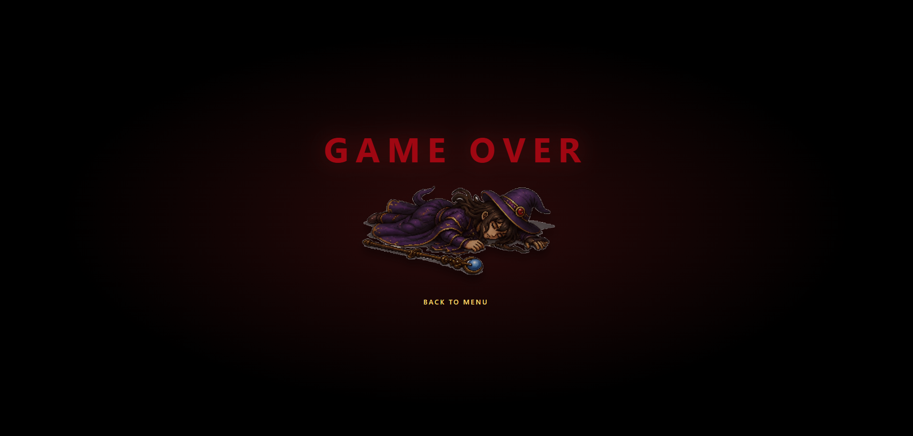

<p align="center">
  
</p>

# ⚔️ BATTLE ODYSSEY

> A dark fantasy turn-based RPG — choose your hero and survive three battles.
>
> Built with React + Vite and a Laravel REST API.

<p align="center">
  
  
  
  
  
</p>

<p align="center">
  
</p>

<p align="center">
  
</p>

<p align="center">
  <a href="https://github.com/M3lgone/battle-odyssey-api">Backend repository</a>
</p>

## Table of Contents

- [What is Battle Odyssey?](#what-is-battle-odyssey)
- [How to Play](#-how-to-play)
- [The End of the Odyssey](#-the-end-of-the-odyssey)
- [Features](#-features)
- [Combat System](#️-combat-system)
- [Characters & Enemies](#-characters--enemies)
- [Tech Stack](#️-tech-stack)
- [Project Structure](#-project-structure)
- [Getting Started](#-getting-started)
- [Backend / API](#-backend--api)

## What is Battle Odyssey?

Battle Odyssey is a dark fantasy turn-based RPG.

You create an account, choose one of three heroes and fight a fixed run of three enemies: **Goblin → Troll → Orc**. Every turn you decide what to do — attack, unleash a skill, defend or try to flee — while managing your HP and MP. Between battles you can push on with your current health or rest to recover fully. Survive all three battles to complete the run.

## 🗺️ How to Play

### 1. Start

From the Title Screen, press any key or click to reach the login page.

### 2. Create an account

Register with your name, email and password. Registration takes you to the login page.

### 3. Log in

Log in with your email and password to access the Main Menu.

### 4. Choose your hero

Pick between **Warrior**, **Mage** and **Archer**. Each hero shows its stats (HP, MP, ATK, DEF) and skills so you can compare them before fighting.

<p align="center">
  
</p>

### 5. Start a game

Start a new game with your chosen hero. Every run follows the same enemy sequence:

**Goblin → Troll → Orc**

You can only have one active game at a time — finish or abandon it before starting a new one.

### 6. Fight

On your turn you can:

- **Attack** — deal damage based on your ATK.
- **Skill** — deal the skill's configured damage. Skills consume MP.
- **Defend** — reduce the next incoming damage.
- **Flee** — try to escape the battle (80% success chance).

Keep an eye on your HP and MP bars and on the battle log.

### 7. Between battles

After winning a battle (while the run is still active) you reach the Between Battles screen, where you can:

- **Continue** with your current HP/MP, or
- **Rest & Next** to restore HP/MP completely before the next fight.

You can also go back to the menu — your run stays active and can be resumed with **Continue**.

<p align="center">
  
</p>

### 8. Finish the run

- Winning all three battles leads to the **Victory Final** screen.
- Losing a battle leads to **Game Over**.
- Fleeing ends the battle and returns you to the menu.

### 📜 Battle History

While a game is active, you can open its battle history from the Main Menu. Keep track of every battle in the current run, including results, damage dealt, damage received and remaining HP/MP.

<p align="center">
  
</p>

## 🏆 The End of the Odyssey

Defeat all three enemies and your hero claims victory. Fall in battle and the run ends — every odyssey has an ending, one way or another.

<p align="center">
  
  
</p>

## ✨ Features

### Gameplay

- Three-battle RPG run (Goblin → Troll → Orc).
- Turn-based combat: Attack, Skill, Defend and Flee.
- Enemy AI that defends, uses skills or attacks.
- HP/MP management during and between battles.
- HP/MP carry-over between battles plus a rest mechanic.
- Battle history for the active game.

### Player & Account

- Registration, login and logout.
- Profile viewing, editing and deletion.
- Character catalogue with stats and skill details.
- Global skill catalogue.

### Admin

- Character CRUD.
- Enemy CRUD.
- Skill CRUD.
- User management (list, edit, delete).

### UI / UX

- Dark fantasy visual style with pixel-art sprites.
- Character-specific animations and battle effects (attacks, projectiles, shields).
- Floating damage numbers and battle log.
- Dedicated Title, Game Over and Victory screens.
- Reusable UI components (buttons, inputs, windows, dialogs).

---

## ⚔️ Combat System

- **Attack** damage is based on the attacker's ATK.
- **Defend** reduces the next incoming damage by the defender's DEF, with a minimum damage of 1.
- **Skills** deal their configured damage and consume MP. A skill cannot be used without enough MP — the turn is not consumed.
- **Flee** has an 80% success chance. Failing leaves you exposed to a free enemy hit.
- **Enemy AI** can defend (~20%), attempt a skill (~30%, falling back to a basic attack without enough MP) or perform a basic attack.
- **HP/MP persistence:** battle results (outcome, final HP/MP, damage totals) are saved to the API. HP/MP carry over between battles unless you choose **Rest & Next**, which restores them to maximum.

---

## 🧙 Characters & Enemies

### Characters

| Hero    | HP  | MP  | ATK | DEF | Main Skill                |
| ------- | --- | --- | --- | --- | ------------------------- |
| Warrior | 120 | 100 | 15  | 20  | Slash — 20 dmg / 15 MP    |
| Mage    | 100 | 120 | 10  | 15  | Fireball — 30 dmg / 10 MP |
| Archer  | 100 | 100 | 25  | 15  | Power Shot — 35 dmg / 25 MP |

### Enemies

| #  | Enemy  | HP  | MP  | ATK | DEF | Skill                  |
| -- | ------ | --- | --- | --- | --- | ---------------------- |
| 1  | Goblin | 80  | 30  | 10  | 5   | Hack — 15 dmg / 5 MP   |
| 2  | Troll  | 100 | 50  | 18  | 12  | Smash — 25 dmg / 10 MP |
| 3  | Orc 👑 | 180 | 80  | 22  | 15  | Rampage — 35 dmg / 25 MP |

The Orc is the final boss encounter of the run.

## 🛠️ Tech Stack

### Frontend

- React 19
- React Router
- Vite 8
- Tailwind CSS 4
- Axios

### Backend

- Laravel 13
- PHP 8.4+ (documented requirement)
- Laravel Passport (OAuth2 Bearer authentication)
- Scribe (API documentation)

### Database

- MySQL

### Tooling

- ESLint
- Composer
- npm

## 📁 Project Structure

The frontend and the backend are independent repositories:

```text
project-front/
├── battle-odyssey-front/   # React frontend (this repository)
└── battle-odyssey-api/     # Laravel REST API + MySQL
```

The React app renders the game and resolves combat turns in the browser, while the Laravel API handles authentication, persistence (games, battles, characters, enemies, skills) and role-based access (player / admin).

Simplified frontend tree:

```text
battle-odyssey-front/
├── src/
│   ├── api/            # Axios client + games, battles, auth, characters...
│   ├── pages/          # Title, Login, Register, Menu, Battle, BetweenBattles...
│   │   └── admin/      # Users, Characters, Enemies, Skills CRUD
│   ├── components/
│   │   ├── battle/     # Combat UI and effects (scene, actions, log...)
│   │   └── ui/         # Reusable UI (Button, Input, Window...)
│   ├── services/       # Turn-by-turn battle resolution
│   ├── hooks/          # Animation and battle state hooks
│   ├── utils/          # Sprite mappings (characters, enemies, skills)
│   └── assets/         # Game artwork
├── public/
├── index.html
├── vite.config.js
└── .env.example
```

## 🚀 Getting Started

You need both repositories running: the Laravel API first, then this frontend.

### Prerequisites

- Git
- Node.js 20+ (recommended)
- PHP 8.4+
- Composer
- MySQL

### Backend setup

```bash
git clone https://github.com/M3lgone/battle-odyssey-api.git
cd battle-odyssey-api
```

```bash
composer install
cp .env.example .env
php artisan key:generate
php artisan passport:keys
```

Edit `.env` with your MySQL database, then:

```bash
php artisan migrate --seed
php artisan serve
```

The API runs at `http://localhost:8000`, with endpoints under `/api/v1/`.

Seeded test accounts:

| Role   | Email             | Password |
| ------ | ----------------- | -------- |
| Admin  | admin@example.com | admin123 |
| Player | test@example.com  | password |

### Frontend setup

```bash
git clone <battle-odyssey-front-url>
cd battle-odyssey-front
npm install
```

Point the frontend to your local API:

```bash
cp .env.example .env
```

```env
VITE_API_BASE_URL=http://localhost:8000
```

Then start the dev server:

```bash
npm run dev
```

Open the printed local URL (usually `http://localhost:5173`), register an account and play.

Useful scripts:

```bash
npm run dev      # start dev server
npm run build    # production build
npm run preview  # preview production build
npm run lint     # run ESLint
```

## Environment Variables

### Frontend

| Variable            | Example                 | Description                               |
| ------------------- | ----------------------- | ----------------------------------------- |
| `VITE_API_BASE_URL` | `http://localhost:8000` | Base URL of the Laravel API (no `/api/v1` — the Axios client appends it). |

### Backend

The backend uses the standard Laravel + MySQL configuration (app key, app URL, database credentials, Passport keys). See the [backend repository](https://github.com/M3lgone/battle-odyssey-api) README for the full setup. Never commit real secrets.

## 🔌 Backend / API

Battle Odyssey uses a Laravel REST API for authentication, users, characters, skills, games, battles and admin management. This frontend consumes it; turn resolution happens in the browser and only battle outcomes are persisted.

- Backend repository: [battle-odyssey-api](https://github.com/M3lgone/battle-odyssey-api)
- Local API: `http://localhost:8000/api/v1/`
- Local docs (Scribe): `http://localhost:8000/docs`

## 🐳 Run with Docker

> 🐳 Docker support is planned for the frontend, Laravel API and MySQL using Docker Compose.

Docker setup and commands will be documented here once the containerized environment is available.

## Credits

Created by Ismael Gonzalez.
